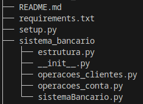

<h1>
    
    Formação Python Developer
</h1>

# :computer: Desafio de projeto: 

## Descomplicando a Criação de Pacotes

Esse desafio compreende a criação de pacotes python. Eu gerei o pacote usando como base o projeto do desafio bancário em POO:

https://github.com/tsdes-santiago/projetoDIOsistemaBancarioPOO

# :bulb: Solução do desafio

Pacote estruturado da seguinte forma:

Arquivo para a instalação gerado com o commando, o qual cria o diretório "dist":

<code>$python setup.py sdist bdist_wheel </code>

Instalado para teste, dentro do diretório "dist":

<code> $pip install sistema_bancario-0.0.1-py3-none-any. </code>

O projeto não foi publicado no Test Pypi. 
